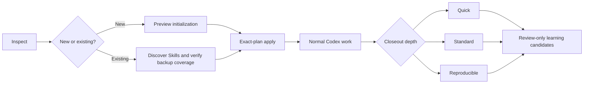

<p align="center">
  
</p>

<h1 align="center">ArchMarshal</h1>

<p align="center">
  <strong>A safety-first management plugin for Codex projects and Skills.</strong><br>
  Keep Skills modular, project files human-readable, and Codex sharper as your workspace grows.
</p>

<p align="center">
  <a href="https://github.com/yptang98/ArchMarshal/actions/workflows/ci.yml"></a>
  
  
  
</p>

ArchMarshal is not a separate agent application. It is a Codex plugin that turns
natural-language requests into reviewed, deterministic project and Skill
management operations. Existing files stay human-readable and remain owned by
the user.

> **Agents should become sharper over time, not heavier.**

## Install with one Codex prompt

Copy the entire prompt below into Codex. It handles a first installation or a
safe update, pins the repository to a reviewed commit, avoids the current
project, and verifies the installed plugin before reporting success.

<!-- BEGIN INSTALL PROMPT -->
```text
请在当前 Codex 环境中安装或安全更新 ArchMarshal 管理插件，来源只能是 https://github.com/yptang98/ArchMarshal 。

这是一次 Codex 插件安装任务，不是项目整理任务。安装期间不要运行 ArchMarshal 管理当前项目，不要在当前项目中 clone、创建虚拟环境、写计划文件或修改任何项目/Skill 文件。只允许修改 Codex 自己管理的 marketplace、plugin cache，以及 CODEX_HOME 下专用于 ArchMarshal 的备份或隔离运行时目录。

请按以下安全约束执行，不要把步骤转交给我手工完成：

1. 先确认本机存在可用的 `codex plugin`、Git，以及 Python 3.10–3.13。复用本机已有 Git/GitHub 认证；绝不索取、打印、复制或写入 token、密码、cookie、SSH 私钥和完整 Codex 配置。
2. 从远端默认分支解析当前提交为完整 40 位 SHA（例如使用 `git ls-remote`），并确认该 SHA 的 GitHub Actions CI 已成功。只安装这个完整 SHA，不安装未固定的 `main`，也不要使用文档中的占位符。
3. 在安装前读取 `codex plugin marketplace list --json` 和 `codex plugin list --available --json`。目标 marketplace 必须唯一命名为 `archmarshal`，目标插件必须是 `archmarshal@archmarshal`。如果同名项指向其他仓库、来源不明或存在多个候选，立即停止且不要改动。
4. 如果这是首次安装，执行 `codex plugin marketplace add yptang98/ArchMarshal --ref`，并把第 2 步实际解析、核验过的完整 SHA 作为紧随 `--ref` 的参数；然后执行：
   `codex plugin add archmarshal@archmarshal`
5. 如果已安装且就是同一 SHA/版本，不做重复变更。如果需要更新：先识别它是用户本地 checkout 还是 Codex 管理的 Git 快照。不要删除、移动或改写用户本地 checkout；这种情况只验证并报告。对于 Codex 管理的快照，必须先把旧的仓库身份、完整 ref、版本和相关路径记录到 CODEX_HOME 下带 UTC 时间戳的 `backups/archmarshal/` 目录，并备份现有 ArchMarshal marketplace 快照与插件缓存。不要备份整个 Codex 配置或任何凭据。只有在旧版本可恢复、备份校验通过时，才通过 `codex plugin` 命令移除旧插件/marketplace，再用新的完整 SHA 重新添加。任一步失败都停止并恢复旧的已知良好版本，不留下“半安装”状态。
6. 安装后再次查询插件列表，要求 `archmarshal@archmarshal` 同时为 installed 和 enabled。找到已安装插件内的 `scripts/run_archmarshal.py`，用合适的 Python 运行 `--bootstrap-status`；只有输出同时满足 `mode=ready`、`verified=true`、`marketplace=archmarshal`、`dependency_imported=false`、插件与 engine 版本一致，才算身份校验成功。
7. 再使用同一个 launcher 对一个位于系统临时目录、尚不存在的探测路径运行只读 `doctor`。不得指向当前项目。若缺少 Python 依赖，不要污染系统 Python；在 CODEX_HOME 的 `runtimes/archmarshal/` 下以实际完整 commit SHA 为目录名创建隔离虚拟环境（要求复制解释器而不是创建解释器符号链接）。只读取已固定 SHA 中 `pyproject.toml` 声明的依赖，只安装它们的 wheel 依赖闭包，不把 ArchMarshal engine 另装成环境包，不接受额外包、任意 URL 或源码构建；保留 pip 安装报告并运行 `pip check`。然后用该解释器重新验证。验证成功后，以原子替换方式写入 `CODEX_HOME/runtimes/archmarshal/current.json`。该 JSON 只能包含 `format`、`commit`、`engine_version`、`python` 四个字段：`format` 固定为 `archmarshal-runtime-v1`，其余字段分别使用本次实际完整 SHA、实际 engine 版本和隔离环境解释器的绝对路径。launcher 会校验版本、SHA 和解释器边界后供后续调用。若无法安全建立隔离运行时，就明确报告未完成，不要声称安装成功。
8. 最后报告：安装或更新结果、完整 commit SHA、插件/engine 版本、是否创建备份及其路径、bootstrap 与只读 doctor 的验证结果。不要在安装任务中接管或整理当前项目。提醒我新建一个 Codex 任务后直接用自然语言调用 ArchMarshal。
```
<!-- END INSTALL PROMPT -->

The same prompt is available as a standalone file:
[INSTALL_PROMPT.md](INSTALL_PROMPT.md).

The official lower-level command flow is summarized for maintainers in
[Getting Started](docs/getting-started.md). It intentionally requires a real,
reviewed full SHA; there is no fake copy-paste placeholder in the primary user
flow.

## Use it directly in Codex

Start a new Codex task after installation. There is no separate ArchMarshal app
or command window to learn. Ask for the outcome:

```text
用 ArchMarshal 检查这个项目和已有 Skills，先只诊断，不修改文件。
用 ArchMarshal 安全接管这个已有项目；先备份并给我看精确计划。
用 ArchMarshal 初始化这个新项目，标签是 research、python。
项目结束了，用 ArchMarshal 做认真整理，记录关键步骤和脚本。
做可复现级整理：保留完整证据、命令和参考运行脚本。
从最近几个项目提炼可复用 Skill 和我的偏好，但不要自动启用。
```

Codex loads the ArchMarshal Skill, chooses the matching workflow, and invokes
the locked Python safety engine internally. The CLI is an implementation and
automation boundary, not a second product experience.

## The managed lifecycle



- **At project start:** initialize a new layout or adopt an existing project
  through a metadata overlay. Existing Skill packages are discovered,
  fingerprinted, backed up, and quarantined pending review.
- **During work:** keep active project material readable, registry-backed, and
  separate from history/cache. Skills resolve by tags, triggers, negative
  triggers, status, scope, and verified package identity.
- **At closeout:** choose quick, standard, or reproducible evidence. Records are
  append-only under date-organized history and are committed last.
- **Across projects:** catalog by recorded date and AND-filtered tags; propose
  common-Skill and user-preference candidates from repeated committed evidence.
  Promotion remains a separate human-reviewed action.

## What it manages

- Global policy stays tiny and high priority.
- Functional, common-project, project, and generated Skills remain distinct.
- Common Skills can carry their own scripts, references, templates, assets, and
  dependency declarations as one fingerprinted package.
- Project artifacts, memory stores, and memory records have ownership,
  lifecycle, privacy, evidence, and explicit-read policy.
- Historical outputs live under date-organized paths; project catalogs use
  recorded creation dates and tags rather than scanning raw histories.
- Built-in CLI domains load lazily. Project and user Skill code remains data
  until a host deliberately chooses to execute it.

## Safety model

ArchMarshal is preview-first and fail-closed:

- Read-only inspection does not create an absent project root.
- Existing user project and Skill files are never normalized, overwritten,
  moved, renamed, or deleted.
- Adoption requires complete package-to-backup coverage before the first
  managed file is created.
- Apply requires the exact reviewed plan and, where relevant, the expected
  immutable `HEAD`; stale or concurrent plans fail.
- Control state uses create-only transactions, content hashes, immutable
  generations, OS-lifetime locks, and compare-and-swap publication.
- Imported Skills remain quarantined until exact package and routing approval.
  A later package or policy change invalidates that approval.
- Partial output is preserved for diagnosis; recovery is forward-only.
- Candidate drafts contain `SKILL.md.draft`, not an auto-discoverable
  `SKILL.md`, until a human finishes review.
- Restore targets must be new directories. Rollback publishes a new audited
  generation and does not rewrite source files.
- Secret-like inline values are blocked, but user-selected summaries and script
  snapshots still require review before recording.

The current filesystem backend blocks static links/reparse points and handles
cooperative concurrency. It does not claim protection from a malicious process
with the same permissions replacing ancestor directories during a write; a
handle-relative backend remains a release gate.

## Compatibility

ArchMarshal can govern evidence produced by orchestration tools without taking
over their scheduler. For CostMarshal, the intended boundary is:

- CostMarshal owns provider routing, attempts, budgets, and leader acceptance.
- ArchMarshal owns project/Skill inventory, reviewed backup boundaries,
  closeout evidence, and reusable-candidate governance.
- Integration should exchange accepted manifests/reports through explicit
  paths or contracts; neither tool should edit the other's internal state.

The current generic artifact model can preserve CostMarshal outputs when the
user places those paths in scope, and the repository documents this boundary.
A first-class bidirectional bridge remains planned; compatibility is not
presented as completed integration.

## Current boundaries

- This is an alpha repository marketplace plugin, not a claim of inclusion in
  Codex's public curated marketplace.
- It uses Codex's interface; it does not ship a separate embedded UI.
- Plugin installation changes Codex-managed plugin state. Project engine
  operations do not silently mutate global Codex configuration.
- No automatic third-party Skill installation or global Skill promotion.
- No automatic project-directory rewrite or deletion of human-owned content.
- No execution claim: reproducible closeout records evidence and a reference
  run script but does not prove that commands succeeded.
- Promoted Skill script execution is advisory/host-controlled today.

## Repository map

```text
ArchMarshal/
├─ INSTALL_PROMPT.md          # copy-paste Codex installer/update prompt
├─ README.md                  # product overview and safety contract
├─ .agents/plugins/           # repository marketplace manifest
├─ plugins/archmarshal/       # Codex plugin, Skill, wrapper, engine lock
├─ src/archmarshal/           # deterministic safety engine
├─ schemas/                   # public workspace/Skill/artifact schemas
├─ templates/                 # project, Skill, and context templates
├─ docs/                      # architecture, contracts, safety, release docs
├─ examples/                  # human-readable sample workspaces
└─ tests/                     # behavioral, security, scale, distribution tests
```

Useful references:

- [Getting Started](docs/getting-started.md)
- [Architecture](docs/architecture.md)
- [Product Requirements](docs/product-requirements.md)
- [CLI Contract](docs/cli-contract.md)
- [Filesystem Safety Contract](docs/filesystem-safety.md)
- [Product Readiness](docs/product-readiness.md)
- [Release Process](docs/release-process.md)

## Development

The direct Python install is for contributors and CI, not ordinary plugin
users:

```bash
python -m pip install -e ".[dev]"
python -m pytest
python -m ruff check .
```

To inspect the engine without installing it:

```powershell
$env:PYTHONPATH = "src"
python -m archmarshal doctor examples/simple-project --pretty
```

See [CLI Contract](docs/cli-contract.md) for automation commands. Do not save
exact preview JSON inside a managed project merely to drive apply; use a system
temporary path or a user-approved evidence location outside the project.

## License

MIT
