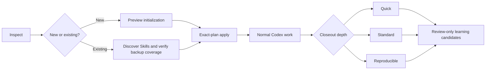

<p align="center">
  
</p>

<h1 align="center">ArchMarshal</h1>

<p align="center">
  <strong>A safety-first management plugin for Codex projects and Skills.</strong><br>
  Keep Skills modular, project files human-readable, and Codex sharper as your workspace grows.
</p>

<p align="center">
  <a href="https://github.com/yptang98/ArchMarshal/actions/workflows/ci.yml"></a>
  
  
  
</p>

ArchMarshal is not a separate agent application. It is a Codex plugin that turns
natural-language requests into reviewed, deterministic project and Skill
management operations. Existing files stay human-readable and remain owned by
the user.

> **Agents should become sharper over time, not heavier.**

## Install with one Codex prompt

Copy the entire prompt below into Codex. It handles a first installation or a
safe update, pins the repository to a reviewed commit, avoids the current
project, and verifies the installed plugin before reporting success.

<!-- BEGIN INSTALL PROMPT -->
```text
Install or safely update the ArchMarshal management plugin in the current Codex environment. The only allowed source is https://github.com/yptang98/ArchMarshal.

This is a Codex plugin installation task, not a project-governance task. During installation, do not run ArchMarshal against the current project. Do not clone into the current project, create a virtual environment there, save plan files there, or modify any project or Skill file. Changes are limited to Codex-managed marketplace state, the plugin cache, and ArchMarshal-specific backup or isolated-runtime directories under CODEX_HOME.

Complete the work yourself under these safety constraints; do not hand the steps back to me:

1. Confirm that `codex plugin`, Git, and Python 3.10–3.13 are available. Reuse existing Git/GitHub authentication. Never request, print, copy, or write tokens, passwords, cookies, SSH private keys, or the complete Codex configuration.
2. Resolve the remote default branch HEAD to a full 40-character commit SHA, for example with `git ls-remote`, and confirm that GitHub Actions CI succeeded for that exact SHA. Install only that full SHA. Do not install an unpinned `main` branch or use a documentation placeholder.
3. Before changing anything, inspect `codex plugin marketplace list --json` and `codex plugin list --available --json`. The marketplace must be uniquely named `archmarshal`, and the plugin must be `archmarshal@archmarshal`. If the same name points elsewhere, its origin is uncertain, or multiple candidates exist, stop without changing anything.
4. For a first installation, run `codex plugin marketplace add yptang98/ArchMarshal --ref` with the resolved and verified SHA from step 2 as the argument immediately after `--ref`. Then run:
   `codex plugin add archmarshal@archmarshal`
5. If the same SHA and version are already installed, make no redundant changes. If an update is needed, first determine whether the existing marketplace is a user-owned local checkout or a Codex-managed Git snapshot. Never delete, move, or rewrite a user-owned checkout; only verify and report it. For a Codex-managed snapshot, first record the old repository identity, full ref, version, and related paths in a UTC-timestamped `backups/archmarshal/` directory under CODEX_HOME, then back up the existing ArchMarshal marketplace snapshot and plugin cache. Do not back up the complete Codex configuration or any credentials. Remove and re-add the old plugin and marketplace through `codex plugin` commands only after the old version is recoverable and the backup verifies. Re-add the new version with the new full SHA. If any step fails, stop and restore the last known-good version instead of leaving a partial installation.
6. Query the plugin list again. Require `archmarshal@archmarshal` to be both installed and enabled. Locate `scripts/run_archmarshal.py` inside the installed plugin and run it with `--bootstrap-status` using an appropriate Python interpreter. Identity verification succeeds only when the result has `mode=ready`, `verified=true`, `marketplace=archmarshal`, `dependency_imported=false`, and matching plugin and engine versions.
7. Use the same launcher to run read-only `doctor` against a path in the system temporary directory that does not yet exist. Never point this probe at the current project. If Python dependencies are missing, do not modify the system Python environment. Create an isolated environment below `CODEX_HOME/runtimes/archmarshal/`, using the actual full commit SHA as the directory name and copying the interpreter instead of creating an interpreter symlink. Read dependency declarations only from `pyproject.toml` at the pinned SHA. Install only their wheel dependency closure; do not install the ArchMarshal engine itself as an environment package, accept extra packages or arbitrary URLs, or build from source. Keep the pip installation report and run `pip check`, then repeat verification with that interpreter. After successful verification, atomically replace `CODEX_HOME/runtimes/archmarshal/current.json`. This JSON object may contain only `format`, `commit`, `engine_version`, and `python`: set `format` to `archmarshal-runtime-v1`, and set the other values to the actual full SHA, actual engine version, and absolute path of the isolated interpreter. The launcher will validate the version, SHA shape, and interpreter boundary before later use. If a safe isolated runtime cannot be established, report the installation as incomplete; do not claim success.
8. Report the installation or update result, full commit SHA, plugin and engine versions, whether a backup was created and where, and the bootstrap and read-only doctor results. Do not adopt or reorganize the current project during installation. Remind me to start a new Codex task and invoke ArchMarshal directly in natural language.
```
<!-- END INSTALL PROMPT -->

The same prompt is available as a standalone file:
[INSTALL_PROMPT.md](INSTALL_PROMPT.md).

## Update command

The installation prompt is idempotent: it installs, safely updates, or reports
an exact-version no-op. An already installed copy also supports this direct
Codex request:

```text
Update ArchMarshal safely to the latest verified version. Do not manage or modify the current project during the update.
```

For a complete standalone update request, copy
[UPDATE_PROMPT.md](UPDATE_PROMPT.md). Updates verify the exact remote commit and
CI result, back up the current Codex-managed ArchMarshal snapshot, preserve
user-owned local marketplaces, validate the replacement, and restore the last
known-good pinned version on failure.

The official lower-level command flow is summarized for maintainers in
[Getting Started](docs/getting-started.md). It intentionally requires a real,
reviewed full SHA; there is no fake copy-paste placeholder in the primary user
flow.

## Use it directly in Codex

Start a new Codex task after installation. There is no separate ArchMarshal app
or command window to learn. Ask for the outcome:

```text
Use ArchMarshal to inspect this project and its existing Skills. Diagnose only; do not modify files.
Use ArchMarshal to safely adopt this existing project. Back it up first and show me the exact plan.
Use ArchMarshal to manage this project but never manage skills/costmarshal or skills/private-local. Show every Skill directory you plan to manage first.
Use ArchMarshal to initialize this new project with the tags research and python.
Update ArchMarshal safely. Do not run project governance during the update.
Close this project with a careful record of the key steps and scripts.
Create a reproducible closeout with complete evidence, commands, and a reference run script.
Extract reusable Skills and my project preferences from recent projects, but do not activate them automatically.
```

Codex loads the ArchMarshal Skill, chooses the matching workflow, and invokes
the locked Python safety engine internally. The CLI is an implementation and
automation boundary, not a second product experience.

## The managed lifecycle



- **At project start:** initialize a new layout or adopt an existing project
  through a metadata overlay. Preview lists every Skill directory prepared for
  management before apply. Exact package exclusions persist across runs.
  Managed source is fingerprinted, backed up, and quarantined pending review;
  VCS metadata, caches, virtual environments, and dependency trees remain
  preserved outside the managed boundary.
- **During work:** keep active project material readable, registry-backed, and
  separate from history/cache. Skills resolve by tags, triggers, negative
  triggers, status, scope, and verified package identity.
- **At closeout:** choose quick, standard, or reproducible evidence. Records are
  append-only under date-organized history and are committed last.
- **Across projects:** catalog by recorded date and AND-filtered tags; propose
  common-Skill and user-preference candidates from repeated committed evidence.
  Promotion remains a separate human-reviewed action.

## What it manages

- Global policy stays tiny and high priority.
- Functional, common-project, project, and generated Skills remain distinct.
- Common Skills can carry their own scripts, references, templates, assets, and
  dependency declarations as one fingerprinted package.
- Project artifacts, memory stores, and memory records have ownership,
  lifecycle, privacy, evidence, and explicit-read policy.
- Historical outputs live under date-organized paths; project catalogs use
  recorded creation dates and tags rather than scanning raw histories.
- Built-in CLI domains load lazily. Project and user Skill code remains data
  until a host deliberately chooses to execute it.

## Safety model

ArchMarshal is preview-first and fail-closed:

- Read-only inspection does not create an absent project root.
- Existing user project and Skill files are never normalized, overwritten,
  moved, renamed, or deleted.
- Adoption requires complete managed-source backup coverage before the first
  managed file is created.
- Repeatable exact Skill exclusions are evaluated before package content is
  read and persist in immutable index history. Excluded package contents are not
  backed up, overlaid, indexed, activated, learned from, moved, or modified.
  Restoring management is a separate explicit action.
- `.git` and other VCS metadata, caches, virtual environments, dependency
  trees, and runtime/build artifacts are reported as preserved boundaries.
  Their contents are not inspected merely to adopt the remaining Skill source.
- Apply requires the exact reviewed plan and, where relevant, the expected
  immutable `HEAD`; stale or concurrent plans fail.
- Control state uses create-only transactions, content hashes, immutable
  generations, OS-lifetime locks, and compare-and-swap publication.
- Imported Skills remain quarantined until exact package and routing approval.
  A later package or policy change invalidates that approval.
- Partial output is preserved for diagnosis; recovery is forward-only.
- Candidate drafts contain `SKILL.md.draft`, not an auto-discoverable
  `SKILL.md`, until a human finishes review.
- Restore targets must be new directories. Rollback publishes a new audited
  generation and does not rewrite source files.
- Secret-like inline values are blocked, but user-selected summaries and script
  snapshots still require review before recording.

The current filesystem backend blocks static links/reparse points and handles
cooperative concurrency. It does not claim protection from a malicious process
with the same permissions replacing ancestor directories during a write; a
handle-relative backend remains a release gate.

## Compatibility

ArchMarshal can govern evidence produced by orchestration tools without taking
over their scheduler. For CostMarshal, the intended boundary is:

- CostMarshal owns provider routing, attempts, budgets, and leader acceptance.
- ArchMarshal owns project/Skill inventory, reviewed backup boundaries,
  closeout evidence, and reusable-candidate governance.
- Integration should exchange accepted manifests/reports through explicit
  paths or contracts; neither tool should edit the other's internal state.

Users can now place one or more CostMarshal Skill packages outside ArchMarshal's
management boundary with exact persistent exclusions while ArchMarshal governs
the rest of the project. This is isolation compatibility, not a bidirectional
runtime bridge: accepted manifests/reports can be exchanged explicitly, while
automatic scheduler/governance synchronization remains planned.

## Current boundaries

- This is an alpha repository marketplace plugin, not a claim of inclusion in
  Codex's public curated marketplace.
- It uses Codex's interface; it does not ship a separate embedded UI.
- Plugin installation changes Codex-managed plugin state. Project engine
  operations do not silently mutate global Codex configuration.
- No automatic third-party Skill installation or global Skill promotion.
- No automatic project-directory rewrite or deletion of human-owned content.
- No execution claim: reproducible closeout records evidence and a reference
  run script but does not prove that commands succeeded.
- Promoted Skill script execution is advisory/host-controlled today.

## Repository map

```text
ArchMarshal/
├─ INSTALL_PROMPT.md          # idempotent Codex installer/update prompt
├─ UPDATE_PROMPT.md           # dedicated Codex update prompt
├─ README.md                  # product overview and safety contract
├─ .agents/plugins/           # repository marketplace manifest
├─ plugins/archmarshal/       # Codex plugin, Skill, wrapper, engine lock
├─ src/archmarshal/           # deterministic safety engine
├─ schemas/                   # public workspace/Skill/artifact schemas
├─ templates/                 # project, Skill, and context templates
├─ docs/                      # architecture, contracts, safety, release docs
├─ examples/                  # human-readable sample workspaces
└─ tests/                     # behavioral, security, scale, distribution tests
```

Useful references:

- [Getting Started](docs/getting-started.md)
- [Architecture](docs/architecture.md)
- [Product Requirements](docs/product-requirements.md)
- [CLI Contract](docs/cli-contract.md)
- [Filesystem Safety Contract](docs/filesystem-safety.md)
- [Product Readiness](docs/product-readiness.md)
- [Release Process](docs/release-process.md)

## Development

The direct Python install is for contributors and CI, not ordinary plugin
users:

```bash
python -m pip install -e ".[dev]"
python -m pytest
python -m ruff check .
```

To inspect the engine without installing it:

```powershell
$env:PYTHONPATH = "src"
python -m archmarshal doctor examples/simple-project --pretty
```

See [CLI Contract](docs/cli-contract.md) for automation commands. Do not save
exact preview JSON inside a managed project merely to drive apply; use a system
temporary path or a user-approved evidence location outside the project.

## License

MIT
