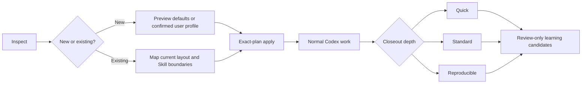

<p align="center">
  
</p>

<h1 align="center">ArchMarshal</h1>

<p align="center">
  <strong>A safety-first management plugin for Codex projects and Skills.</strong><br>
  Keep Skills modular, project files human-readable, and Codex sharper as your workspace grows.
</p>

<p align="center">
  <a href="https://github.com/yptang98/ArchMarshal/actions/workflows/ci.yml"></a>
  
  
  
</p>

ArchMarshal is not a separate agent application. It is a Codex plugin that turns
natural-language requests into reviewed, deterministic project and Skill
management operations. Existing files stay human-readable and remain owned by
the user.

> **Agents should become sharper over time, not heavier.**

<p align="center">
  <a href="#why-archmarshal">Why ArchMarshal</a> |
  <a href="#capabilities-at-a-glance">Capabilities</a> |
  <a href="#install-with-one-codex-prompt">Install</a> |
  <a href="#use-it-directly-in-codex">Use in Codex</a> |
  <a href="#safety-model">Safety</a> |
  <a href="#compatibility">Compatibility</a>
</p>

## Why ArchMarshal

Long-lived Codex workspaces tend to accumulate Skills, reports, scripts,
history, generated files, and local conventions. The usual failure mode is not
a missing file; it is losing track of what is active, what is reusable, what
belongs to the user, and what another agent may safely change.

ArchMarshal adds a small, reviewable control plane around that workspace. It
maps the layout you already use, keeps Skill packages modular, records project
evidence at the depth you choose, and proposes reusable knowledge without
silently promoting it. The control plane is machine-verifiable, while project
files and generated indexes remain easy for a human to inspect.

## Capabilities at a glance

| Capability | What ArchMarshal does | What it does not do |
|---|---|---|
| Adopt an existing project | Inspects the current layout, previews every managed path and Skill root, verifies a backup, then adds a create-only governance overlay. | It does not move, rename, normalize, or overwrite existing files. |
| Initialize a new project | Creates a predictable project and Skill scaffold using confirmed paths, names, timezone, date partitioning, and tags. | It does not force ArchMarshal defaults over an approved user convention. |
| Manage Skills safely | Discovers package boundaries, stores immutable metadata, supports exact persistent exclusions, quarantines new imports, and resolves reviewed Skills by task. | It does not rewrite an existing `SKILL.md` or auto-activate an imported Skill. |
| Keep project files findable | Maps code, reports, history, knowledge, context, memory, and Skill locations into a human-readable `.agent/INDEX.md`. | It does not hide project content in a proprietary database or load all history by default. |
| Close out work | Records quick, standard, or reproducible evidence with append-only files and a final integrity manifest. | It does not claim commands succeeded unless execution was separately validated. |
| Learn across projects | Builds review-only candidates for common Skills and repeated user preferences from committed project evidence. | It does not silently mutate global policy or promote a candidate automatically. |
| Diagnose and recover | Provides read-only health checks, verified backups, restore-to-new-directory, and forward-only rollback for ArchMarshal-owned state. | It does not delete partial evidence or rewrite human-owned source during recovery. |

The practical result is a workspace that can grow without turning the global
Skill layer into a monolith: global policy stays small, reusable capability
packages stay modular, and project-specific knowledge stays with the project.

## Install with one Codex prompt

Copy the entire prompt below into Codex. It handles a first installation or a
safe update, pins the repository to a reviewed commit, avoids the current
project, and verifies the installed plugin before reporting success.

<details>
<summary><strong>Show the complete installation and update prompt</strong></summary>

Copy everything inside the block into a Codex task.

<!-- BEGIN INSTALL PROMPT -->
```text
Install or safely update the ArchMarshal management plugin in the current Codex environment. The only allowed source is https://github.com/yptang98/ArchMarshal.

This is a Codex plugin installation task, not a project-governance task. During installation, do not run ArchMarshal against the current project. Do not clone into the current project, create a virtual environment there, save plan files there, or modify any project or Skill file. Changes are limited to Codex-managed marketplace state, the plugin cache, and ArchMarshal-specific backup or isolated-runtime directories under CODEX_HOME.

Complete the work yourself under these safety constraints; do not hand the steps back to me:

1. Confirm that `codex plugin`, Git, and Python 3.10-3.13 are available. Reuse existing Git/GitHub authentication. Never request, print, copy, or write tokens, passwords, cookies, SSH private keys, or the complete Codex configuration.
2. Resolve the remote default branch HEAD to a full 40-character commit SHA, for example with `git ls-remote`, and confirm that GitHub Actions CI succeeded for that exact SHA. Install only that full SHA. Do not install an unpinned `main` branch or use a documentation placeholder.
3. Before changing anything, inspect `codex plugin marketplace list --json` and `codex plugin list --available --json`. The marketplace must be uniquely named `archmarshal`, and the plugin must be `archmarshal@archmarshal`. If the same name points elsewhere, its origin is uncertain, or multiple candidates exist, stop without changing anything.
4. Record the installed state. If the same full SHA and version are already installed and enabled, make no redundant changes and report a verified no-op. Never delete, move, or rewrite a user-owned checkout; do not reset or pull it. Verify and report it instead of automatically replacing it.
5. Prepare the candidate before changing the active installation. Use a commit-scoped staging directory below `CODEX_HOME/updates/archmarshal/`, never the current project. Fetch only the verified repository and exact SHA. Run the candidate checkout's `plugins/archmarshal/scripts/run_archmarshal.py --bootstrap-status` directly; identity verification requires `mode=ready`, `verified=true`, `marketplace=archmarshal`, `dependency_imported=false`, and matching plugin and engine versions. Run read-only `doctor` against a path in the system temporary directory that does not yet exist by invoking the candidate `invoke_archmarshal.py` directly with the active Python and `-I`; do not temporarily replace `current.json`. The installed old version must remain installed and enabled throughout candidate preparation.
6. Use the active Python as the lightweight fast path. If candidate `doctor` reports missing Python dependencies, do not modify the system Python environment. Prepare a commit-scoped isolated environment below `CODEX_HOME/runtimes/archmarshal/` without publishing it as current yet. Copy the interpreter instead of creating an interpreter symlink. Read dependency declarations only from `pyproject.toml` at the pinned SHA. Install only their wheel dependency closure; do not install the ArchMarshal engine itself as an environment package, accept extra packages or arbitrary URLs, or build from source. Keep the pip installation report, run `pip check`, and use the copied interpreter with `-I` against the candidate `invoke_archmarshal.py` to validate bootstrap plus read-only doctor. If the candidate cannot be fully validated, stop with the installed old version untouched.
7. Before an update cutover, use the candidate's stdlib-only `plugins/archmarshal/scripts/update_support.py create` command to create a small UTC-timestamped last-known-good capsule below `CODEX_HOME/backups/archmarshal/`; do not assemble the capsule with ad hoc copy commands. Record the old repository identity, full ref, version, runtime pointer, and related paths. In repository-relative layout, the helper must preserve `.agents/plugins/marketplace.json`, the old `plugins/archmarshal/` directory, its locked `src/archmarshal/` engine source, and `pyproject.toml`, then publish `CAPSULE.json` last with a hash for every capsule file. Run `update_support.py verify`, verify the capsule launcher and local-marketplace recovery path, retain old commit-scoped runtimes, and record the exact rollback commands. Do not back up the complete marketplace history. Do not back up the complete Codex configuration or any credentials. Do not remove the active old plugin or marketplace until both the candidate and last-known-good capsule are verified.
8. Perform the shortest possible cutover only after preparation succeeds. For a first installation, run `codex plugin marketplace add yptang98/ArchMarshal --ref` with the verified full SHA as the argument immediately after `--ref`, then run `codex plugin add archmarshal@archmarshal`. For a Codex-managed update, use `codex plugin` commands to unregister the old plugin and marketplace and immediately re-add the new full SHA and `archmarshal@archmarshal`; never delete plugin caches manually. Publish a prepared `archmarshal-runtime-v1` pointer to `CODEX_HOME/runtimes/archmarshal/current.json` atomically only after the new plugin is installed. The pointer may contain only `format`, `commit`, `engine_version`, and `python`. If no isolated runtime is needed, leave an absent pointer absent and retain a valid old-version pointer for rollback; the new launcher will ignore that incompatible pointer. Preserve and atomically quarantine a malformed pointer during cutover so it cannot block project commands. Require the installed plugin to be enabled, then repeat bootstrap and read-only doctor through its launcher. On any cutover or validation failure, atomically restore the old runtime pointer and restore the last known-good pinned plugin/marketplace immediately. If the old Git pin cannot be restored, register the verified capsule as a temporary local recovery marketplace and reinstall the old plugin from it; report this recovery mode explicitly. The failed candidate must not replace the working version.
9. Report whether the result was installed, updated, unchanged, refused, or restored; include old/new full SHAs and versions, capsule location, runtime fast path or isolated-runtime choice, bootstrap result, and doctor result. Do not adopt or reorganize the current project during installation. After a version change, remind me that the current task may finish with its already loaded old Skill instructions, while a new Codex task will load the new version.
```
<!-- END INSTALL PROMPT -->

</details>

The same prompt is available as a standalone file:
[INSTALL_PROMPT.md](INSTALL_PROMPT.md).

## Update command

The installation prompt is idempotent: it installs, safely updates, or reports
an exact-version no-op. An already installed copy also supports this direct
Codex request:

```text
Update ArchMarshal safely to the latest verified version. Do not manage or modify the current project during the update.
```

For a complete standalone update request, copy
[UPDATE_PROMPT.md](UPDATE_PROMPT.md). Updates verify the exact remote commit and
CI result, keep the working version enabled while a candidate is staged and
validated, and use the current Python environment when it already works. Only
then does ArchMarshal create a compact last-known-good capsule and perform a
short plugin-state cutover. A failed candidate leaves the old version untouched;
a failed cutover restores the previous pin and runtime pointer immediately.

The official lower-level command flow is summarized for maintainers in
[Getting Started](docs/getting-started.md). It intentionally requires a real,
reviewed full SHA; there is no fake copy-paste placeholder in the primary user
flow.

## Use it directly in Codex

Start a new Codex task after installation. There is no separate ArchMarshal app
or command window to learn. Ask for the outcome:

```text
Use ArchMarshal to inspect this project and its existing Skills. Diagnose only; do not modify files.
Use ArchMarshal to safely adopt this existing project. Back it up first and show me the exact plan.
Use ArchMarshal to preserve my existing reports, plans, history, and Skill layout. Show the detected mapping and ask before adopting it.
Use ArchMarshal with reports in docs/reports, project Skills in .codex/skills/project, Asia/Shanghai time, and YYYY/MM/DD date folders.
Use ArchMarshal to manage this project but never manage skills/costmarshal or skills/private-local. Show every Skill directory you plan to manage first.
Use ArchMarshal to initialize this new project with the tags research and python.
Update ArchMarshal safely. Do not run project governance during the update.
Close this project with a careful record of the key steps and scripts.
Create a reproducible closeout with complete evidence, commands, and a reference run script.
Extract reusable Skills and my project preferences from recent projects, but do not activate them automatically.
```

Codex loads the ArchMarshal Skill, chooses the matching workflow, and invokes
the locked Python safety engine internally. The CLI is an implementation and
automation boundary, not a second product experience.

## The managed lifecycle



| Phase | ArchMarshal behavior | Write boundary |
|---|---|---|
| Inspect | Detects project paths, Skill roots, nested packages, exclusions, VCS/cache boundaries, and objective risks. | Read-only. An absent project root is not created. |
| Adopt or initialize | Shows the complete mapping and exact plan before adding the control plane. Existing projects require verified backup coverage first. | Create-only managed files; existing source remains untouched. |
| Work | Resolves reviewed Skills by tags, triggers, negative triggers, status, scope, and verified package identity. | Active files stay separate from explicit-only history and cache. |
| Close | Records one of three evidence levels under the confirmed path, naming, timezone, and date policy. | Append-only session directory; `COMMITTED.json` is written last. |
| Learn | Catalogs projects by recorded date and tags, then proposes repeated Skill or preference candidates. | Review-only candidates; activation and promotion are separate actions. |

Layout precedence is explicit and auditable:

```text
recognized project configuration
  > explicit choices for this preview
  > promoted confirmed user profile
  > read-only detected evidence
  > ArchMarshal defaults
```

A safe nonstandard layout is treated as reasonable. ArchMarshal may suggest an
improvement, but only unsafe paths block the operation. Detection alone never
becomes a user preference; a convention can be learned only after it is
explicitly confirmed and repeated across committed projects.

## Project and Skill organization

ArchMarshal keeps four Skill roles distinct:

| Skill role | Purpose | Typical scope |
|---|---|---|
| Global policy | Small, high-priority rules that should always apply. | User-wide |
| Functional Skill | A reusable capability selected by task triggers and tags. | User-wide or shared |
| Common project Skill | A reproducible engineering workflow, including its scripts, references, templates, assets, and dependency declarations. | Cross-project |
| Project or generated Skill | Repository-specific guidance or a draft derived from project evidence. | One project |

Project artifacts, context modules, memory stores, and memory records retain
explicit ownership, lifecycle, privacy, evidence, and read policies. Historical
outputs can use date-organized paths, while the project catalog reads compact
metadata instead of scanning raw history. Built-in command domains load lazily,
and user Skill code remains data until a host deliberately executes it.

## Safety model

ArchMarshal is preview-first and fail-closed:

| Safety boundary | Guarantee |
|---|---|
| Before a write | The user sees the exact paths, Skill directories, exclusions, warnings, and plan digest. |
| Existing content | Human-owned project and Skill files are never overwritten, moved, renamed, deleted, or normalized. |
| Backup and recovery | Adoption verifies backup coverage first; restore writes to a new directory; rollback publishes a new audited generation. |
| Skill isolation | Exact exclusions persist, nested packages are separate boundaries, and imported Skills remain quarantined until reviewed. |
| Concurrent or stale work | Immutable generations, hashes, OS-lifetime locks, and expected-`HEAD` checks fail closed. |

<details>
<summary><strong>Read the detailed safety guarantees</strong></summary>

- Read-only inspection does not create an absent project root.
- Existing user project and Skill files are never normalized, overwritten,
  moved, renamed, or deleted.
- Adoption requires complete managed-source backup coverage before the first
  managed file is created.
- Repeatable exact Skill exclusions are evaluated before package content is
  read and persist in immutable index history. Excluded package contents are not
  backed up, overlaid, indexed, activated, learned from, moved, or modified.
  Restoring management is a separate explicit action.
- `.git` and other VCS metadata, caches, virtual environments, dependency
  trees, and runtime/build artifacts are reported as preserved boundaries.
  Their contents are not inspected merely to adopt the remaining Skill source.
- Unsafe save paths fail closed: traversal outside the project, links/reparse
  points, VCS/cache/dependency/runtime boundaries, and file/directory conflicts
  cannot be adopted as output destinations.
- A nested Skill package is a module boundary. Excluding a child package keeps
  its bytes out of the parent package fingerprint, backup, index, and learning
  evidence.
- Apply requires the exact reviewed plan and, where relevant, the expected
  immutable `HEAD`; stale or concurrent plans fail.
- Control state uses create-only transactions, content hashes, immutable
  generations, OS-lifetime locks, and compare-and-swap publication.
- Imported Skills remain quarantined until exact package and routing approval.
  A later package or policy change invalidates that approval.
- Partial output is preserved for diagnosis; recovery is forward-only.
- Candidate drafts contain `SKILL.md.draft`, not an auto-discoverable
  `SKILL.md`, until a human finishes review.
- Restore targets must be new directories. Rollback publishes a new audited
  generation and does not rewrite source files.
- Secret-like inline values are blocked, but user-selected summaries and script
  snapshots still require review before recording.

</details>

The current filesystem backend blocks static links/reparse points and handles
cooperative concurrency. It does not claim protection from a malicious process
with the same permissions replacing ancestor directories during a write; a
handle-relative backend remains a release gate.

## Compatibility

ArchMarshal can govern evidence produced by orchestration tools without taking
over their scheduler. For CostMarshal, the intended boundary is:

| Concern | CostMarshal | ArchMarshal |
|---|---|---|
| Primary role | Provider routing, attempts, budgets, and leader acceptance. | Project and Skill inventory, reviewed backup boundaries, closeout evidence, and reusable-candidate governance. |
| Shared handoff | Produces accepted manifests or reports at explicit paths. | Catalogs or records those accepted artifacts through an explicit contract. |
| Isolation rule | Keeps ownership of orchestration state. | Never edits CostMarshal internal state and may exclude its Skill packages completely. |

Users can now place one or more CostMarshal Skill packages outside ArchMarshal's
management boundary with exact persistent exclusions while ArchMarshal governs
the rest of the project. This is isolation compatibility, not a bidirectional
runtime bridge: accepted manifests/reports can be exchanged explicitly, while
automatic scheduler/governance synchronization remains planned.

## Current boundaries

- This is an alpha repository marketplace plugin, not a claim of inclusion in
  Codex's public curated marketplace.
- It uses Codex's interface; it does not ship a separate embedded UI.
- Plugin installation changes Codex-managed plugin state. Project engine
  operations do not silently mutate global Codex configuration.
- No automatic third-party Skill installation or global Skill promotion.
- No automatic project-directory rewrite or deletion of human-owned content.
- No execution claim: reproducible closeout records evidence and a reference
  run script but does not prove that commands succeeded.
- Promoted Skill script execution is advisory/host-controlled today.

## Repository map

```text
ArchMarshal/
|-- INSTALL_PROMPT.md          # idempotent Codex installer/update prompt
|-- UPDATE_PROMPT.md           # dedicated Codex update prompt
|-- README.md                  # product overview and safety contract
|-- .agents/plugins/           # repository marketplace manifest
|-- plugins/archmarshal/       # Codex plugin, Skill, wrapper, engine lock
|-- src/archmarshal/           # deterministic safety engine
|-- schemas/                   # public workspace/Skill/artifact schemas
|-- templates/                 # project, Skill, and context templates
|-- docs/                      # architecture, contracts, safety, release docs
|-- examples/                  # human-readable sample workspaces
`-- tests/                     # behavioral, security, scale, distribution tests
```

Useful references:

- [Getting Started](docs/getting-started.md)
- [Architecture](docs/architecture.md)
- [Product Requirements](docs/product-requirements.md)
- [CLI Contract](docs/cli-contract.md)
- [Filesystem Safety Contract](docs/filesystem-safety.md)
- [Product Readiness](docs/product-readiness.md)
- [Release Process](docs/release-process.md)

## Development

The direct Python install is for contributors and CI, not ordinary plugin
users:

```bash
python -m pip install -e ".[dev]"
python -m pytest
python -m ruff check .
```

To inspect the engine without installing it:

```powershell
$env:PYTHONPATH = "src"
python -m archmarshal doctor examples/simple-project --pretty
```

See [CLI Contract](docs/cli-contract.md) for automation commands. Do not save
exact preview JSON inside a managed project merely to drive apply; use a system
temporary path or a user-approved evidence location outside the project.

## License

MIT
